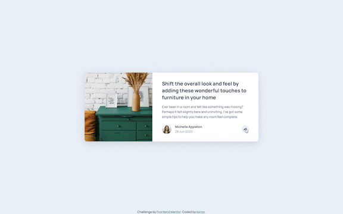
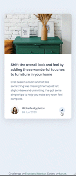

# Frontend Mentor - Article Preview Component Solution

This is a solution to the [Article Preview Component Challenge on Frontend Mentor](https://www.frontendmentor.io/challenges/article-preview-component-dYBN_pYFT). Frontend Mentor challenges help you improve your coding skills by building realistic projects.

## Table of contents

- [Overview](#overview)
  - [The challenge](#the-challenge)
  - [Screenshot](#screenshot)
  - [Links](#links)
- [My process](#my-process)
  - [Built with](#built-with)
  - [What I learned](#what-i-learned)
- [Author](#author)

## Overview

### The challenge

Users should be able to:

- View the optimal layout for the component depending on their device's screen size
- See the social media share links when they click the share icon

### Screenshot

#### Screensize 1440px - Desktop



#### Screensize 375px - Mobile



### Links

- View my Solution on [Frontend Mentor](https://your-solution-url.com)
- View the Live Site [here](https://your-live-site-url.com)

## My process

- HTML semantics
- Importing Google Fonts
- Set variables
- Reset default settings
- Styles (Mobile First)
- JavaScript

### Built with

- Semantic HTML5 markup
- JavaScript
- SASS custom properties
- CSS Grid
- CSS Flexbox
- Mobile-first workflow
- Font Awesome for icons
- [Google Fonts](https://fonts.google.com/) - For Fonts

### What I learned

This was my first time working with JavaScript. Here are some notes:

- I added the expression "use script" at the top of the js file. This feature eliminates silent errors and points out mistakes. A good example is that it prevents you from using undeclared variables.

- I have learned about variables. A variable is like a box with a label on it which stores a certain value. This is the most easy way to describe it.

- For this project I worked with the const variable and the string value. A constant variable cannot be overwritten. A string value can be any text inside double or single quotes.

- I declared const variables, then assigned a specified value to it by selecting elements from the HTML Document Object Model (DOM) by it's specified id and performed an action on it with the method getElementById().

- Then I used the addEventListener() method. Events are actions that occur, usually as a result of something the user does. The click event occurs when a user clicks with a mouse button (press and release) while the pointer is located inside the element. The listener is the object that receives a notification when an event of the specified type occurs. The toggle() method toggles between hide() and show() for the selected elements.

Snippets of my js file:

```js
"use strict";

const clickToShare = document.getElementById("click-to-share");
const activeState = document.getElementById("active-state");
const clickToShare2 = document.getElementById("click-to-share2");

clickToShare.addEventListener("click", () => {
  activeState.classList.toggle("switch");
});

clickToShare2.addEventListener("click", () => {
  activeState.classList.toggle("switch");
});
```

## Author

- Frontend Mentor - [@kxnzx](https://www.frontendmentor.io/profile/kxnzx)
